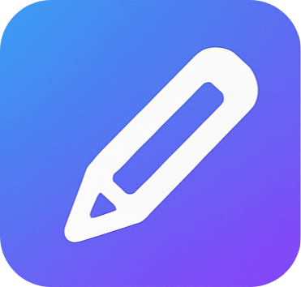

# Codraw
**Interactive HTML Canvas learning & drawing app** — learn, experiment, and export canvas creations.



---

## Table of contents
- [Overview](#overview)  
- [Features](#features)  
- [Installation & usage](#installation--usage)  
- [Development](#development)  
- [Exporting & PDF support](#exporting--pdf-support)  
- [Fonts & assets](#fonts--assets)  
- [License & credits](#license--credits)  
- [Contributing](#contributing)  
- [Contact](#contact)

---

## Overview
**Codraw** is an open-source web application that teaches and demonstrates the HTML5 Canvas API with an interactive editor, live preview, and export tools.  
It’s designed for learners, educators, and creative coders who want to explore the intersection of code and art.

Codraw blends coding and creativity, making it simple to visualize code-driven drawings, generate images, and export projects — all within a modern and minimalist interface.

---

## Features
- 🖌️ Interactive canvas drawing and editing tools (brushes, shapes, fills, strokes).  
- ⚙️ Real-time JavaScript rendering and preview.  
- 🧠 Built-in examples for learning HTML Canvas API.  
- 📁 Export your creations as PDF or directly send on Telegram chanel.  
- 🖋️ Uses open-source fonts for clean, aesthetic typography.  
- 🧩 Lightweight, responsive, and open-source — perfect for learners and tinkerers.

---


## Installation & usage

### 🔧 Quick Start
1. Clone this repository:
   ```bash
   git clone https://github.com/Nikhil-Rajput-x/codraw.git
   cd codraw
   ```
2. Open `index.html` directly in your browser. [⚠️] internet may not work due to CORS protection
- quick fix : use electron app or npm 

If you want a live server with hot reload:
```bash
npx http-server
```
Then open [http://localhost:8080](http://localhost:8080)

---

## Development
All core scripts are in the `scripts/` folder.  
Each module handles a specific functionality (rendering, exporting, image loading).  

You can freely extend the app by:
- Adding new drawing tools or shapes.  
- Creating new sample lessons.  
- Enhancing export options or UI styling.  

---

## Exporting & PDF support
Codraw integrates with:
- **PDF.js** for reading and previewing PDFs (Apache 2.0 License).  
- **jsPDF** for generating and exporting PDFs (MIT License).  

This allows exporting canvas content as `.png` or `.pdf` directly from the browser, without external dependencies.

---

## Fonts & assets
The app uses several open-source fonts for UI and creative design:

| Font | License | Source |
|------|----------|--------|
| Comic Shanns Mono Nerd Font Propo Bold | MIT + OFL 1.1 | [Nerd Fonts](https://github.com/ryanoasis/nerd-fonts) |
| MANIC / MANIC Sketches | SIL OFL 1.1 | Fontshare / Public sources |
| Indie Flower | SIL OFL 1.1 | [Google Fonts](https://fonts.google.com/specimen/Indie+Flower) |
| Dancing Script | SIL OFL 1.1 | [Google Fonts](https://fonts.google.com/specimen/Dancing+Script) |
| Latin Modern Math | GUST Font License | [GUST Foundry](https://www.gust.org.pl/projects/e-foundry/latin-modern) |

See the [CREDITS](./CREDITS) file for full details.

---

## License & credits
**Codraw** is licensed under the **GNU General Public License v3.0**.  
You are free to use, modify, and distribute it under the same license terms.

**Included open-source components:**
- [PDF.js](https://github.com/mozilla/pdf.js) — Apache 2.0  
- [jsPDF](https://github.com/parallax/jsPDF) — MIT  
- [Nerd Fonts](https://github.com/ryanoasis/nerd-fonts) — MIT  
- [Google Fonts](https://fonts.google.com/) — SIL OFL 1.1  

**Developed by:** Nikhil Rajput © 2025  

---

## Contributing
Contributions are welcome!

1. Fork this repository  
2. Create a feature branch:  
   ```bash
   git checkout -b feature/your-feature
   ```
3. Commit your changes:  
   ```bash
   git commit -m "Add new feature"
   ```
4. Push and open a pull request.

---

## Contact
**Author:** Nikhil Rajput  
**GitHub:** [@Nikhil-Rajput-x](https://github.com/Nikhil-Rajput-x)  
**License:** [GNU GPL v3](https://www.gnu.org/licenses/gpl-3.0.en.html)

---

> “Creativity meets code — draw, learn, and experiment with Codraw.”
